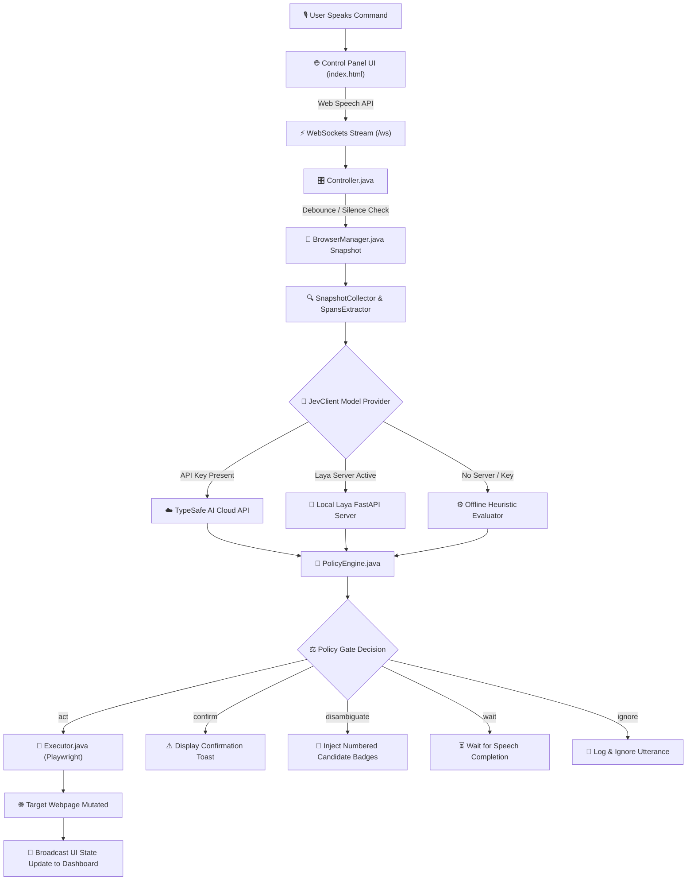
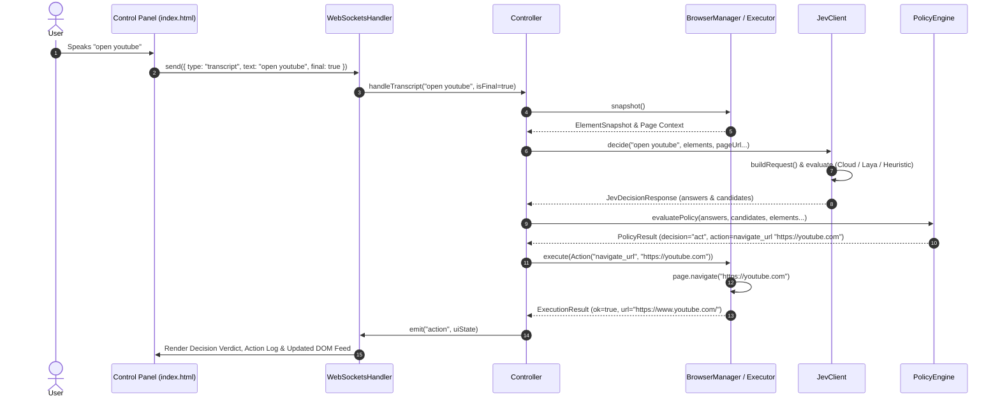

# 🎙️ Voice Browser (Java Edition) — Comprehensive Project Documentation

Welcome to the documentation suite for **Voice Browser (Java Edition)**. This project is a real-time, voice-driven web browser automation application built with **Java 21**, **Spring Boot 3**, and **Playwright Java**. It enables users to navigate, search, click, fill forms, scroll, and switch tabs on websites using continuous natural language speech commands.

---

## 📋 Table of Contents

1. [System Overview](#-system-overview)
2. [Key Features](#-key-features)
3. [Technology Stack](#-technology-stack)
4. [Workflow & Architecture Diagrams](#-workflow--architecture-diagrams)
   - [End-to-End Control Flowchart](#end-to-end-control-flowchart)
   - [Real-Time Interaction Sequence Diagram](#real-time-interaction-sequence-diagram)
5. [Directory Structure](#-directory-structure)
6. [Component Breakdown](#-component-breakdown)
7. [Decision Policy & Safety Gates](#-decision-policy--safety-gates)
8. [Getting Started & Usage](#-getting-started--usage)

---

## 🚀 System Overview

The **Voice Browser** acts as an intelligent intermediary between spoken user intent and browser web page interactions. 

Instead of executing raw speech commands blindly, the system employs **Speculative Question Fan-out** and a multi-stage **Policy Engine** to make safe, confident decision gates (`act`, `wait`, `ignore`, `confirm`, `disambiguate`):

1. **Continuous Speech Input**: Captures live audio streams via Chrome/Edge Web Speech API and debounces interim transcripts.
2. **DOM Snapshot & Candidate Extraction**: Captures interactive page elements (links, inputs, buttons) in viewport order and extracts URL/text candidate spans from spoken phrases.
3. **Model Evaluation & Heuristic Fallback**: Evaluates transcript + DOM state via TypeSafe AI Cloud API, local Laya FastAPI Python model, or an offline rule-based heuristic evaluator.
4. **Safety Policy Gates**: Evaluates confidence thresholds for intent, targets, site matching, phrase completeness, and destructive actions before executing.
5. **Native Browser Automation**: Executes Playwright Java actions (clicking, filling, scrolling, navigation) on a persistent Chromium instance with real-time visual toasts and numbered candidate overlays.

---

## ✨ Key Features

- **Continuous Speech Recognition**: Real-time Web Speech API integration with transcript debouncing and partial utterance cancellation.
- **Visual DOM Element Compaction**: Smart compaction and deduplication of DOM elements, sorting viewport-visible elements first to optimize context size.
- **Triple Evaluation Modes**:
  - **TypeSafe AI Cloud API**: High-accuracy LLM decision engine when `TYPESAFE_API_KEY` is provided.
  - **Local Laya Python Server**: FastAPI Laya model (`http://127.0.0.1:8000/v1/evaluate`) for local offline ML inference.
  - **Zero-Dependency Heuristic Engine**: Built-in fallback rule engine ensuring out-of-the-box execution even without external servers running.
- **Safety & Reversibility**: Destructive actions require explicit spoken confirmation (`confirm`), and actions can be undone (`undo` / `go back`).
- **Interactive Control Room**: Dark-mode Web UI with live decision charts, latency metrics, action logs, token usage, and live element inspector.

---

## 🛠️ Technology Stack

| Layer | Technology / Library | Description |
| :--- | :--- | :--- |
| **Language & Runtime** | Java 21 (OpenJDK 26 LTS runtime) | Core application platform |
| **Framework** | Spring Boot 3.3.4 | Application lifecycle, Dependency Injection, REST endpoints |
| **WebSockets** | Spring WebSocket (JSR-356) | Low-latency bi-directional streaming between control panel & server |
| **Browser Automation**| Playwright Java 1.47.0 | Headless / Headed Chromium automation, element locators, JS injection |
| **JSON Serialization** | Jackson Databind 2.17.2 | DTO serialization, request encoding, state size budgeting |
| **Testing** | JUnit 5 (JUnit Platform 1.10.3) | Unit testing for policy engine, candidate extraction, and element compaction |
| **Frontend UI** | HTML5, Vanilla CSS3, Web Speech API | Embedded control room dashboard served via Spring Boot static resources |

---

## 📊 Workflow & Architecture Diagrams

### End-to-End Control Flowchart

The flowchart below visualizes the decision pipeline from spoken utterance to browser execution:



---

### Real-Time Interaction Sequence Diagram

This sequence diagram details the messaging exchange between components during a command lifecycle:



---

## 📂 Directory Structure

```text
jev-voice-browser/
├── PROJECT_DOCS.md                           <-- Comprehensive documentation suite (this file)
├── README.md                                 <-- Quickstart guide & repository overview
├── pom.xml                                   <-- Maven build file with dependencies
├── run-java.sh                               <-- Execution script for Spring Boot app
├── run.sh                                    <-- Convenience wrapper script
├── laya_server.py                            <-- Local Python model server script (optional)
│
├── src/main/java/ai/typesafe/voicebrowser/
│   ├── VoiceBrowserApplication.java          <-- Spring Boot main entry point
│   │
│   ├── browser/                              <-- Browser Automation & Scripting
│   │   ├── BrowserManager.java               <-- Persistent Chromium context & tab tracking
│   │   ├── Executor.java                     <-- Playwright Java action automation engine
│   │   └── OverlayScript.java                <-- JS injection for toasts & numbered badges
│   │
│   ├── config/
│   │   └── WebSocketConfig.java              <-- Spring WebSocket endpoint mapping (/ws)
│   │
│   ├── controller/                           <-- API & Controller Layer
│   │   ├── Controller.java                   <-- Main state orchestrator & transcript debouncer
│   │   ├── StateApiController.java           <-- REST endpoints (/api/state, /api/questions)
│   │   └── WebSocketsHandler.java            <-- Low-latency WebSocket handler
│   │
│   ├── model/                                <-- Data Transfer & Domain Models
│   │   ├── Action.java                       <-- Action DTO (open, click, fill, scroll...)
│   │   ├── Constants.java                    <-- Centralized thresholds, URLs & site maps
│   │   ├── ElementSnapshot.java              <-- DOM element candidate representation
│   │   └── PolicyResult.java                 <-- Policy evaluation decision container
│   │
│   └── service/                              <-- Business & Intelligence Services
│       ├── JevClient.java                    <-- Multi-backend decision client with heuristic fallback
│       ├── PolicyEngine.java                 <-- Multi-gate policy decision evaluator
│       ├── SnapshotCollector.java            <-- Element filtering, viewport sorting & compaction
│       └── SpansExtractor.java               <-- Regex candidate extraction & spoken URL normalizer
│
├── src/main/resources/
│   ├── application.properties                <-- Server configuration (Port 8787)
│   └── static/
│       └── index.html                        <-- Control room dashboard UI
│
└── src/test/java/ai/typesafe/voicebrowser/service/
    ├── PolicyEngineTest.java                 <-- JUnit 5 tests for PolicyEngine
    ├── SnapshotCollectorTest.java            <-- JUnit 5 tests for SnapshotCollector
    └── SpansExtractorTest.java               <-- JUnit 5 tests for SpansExtractor
```

---

## 🧩 Component Breakdown

### 1. `VoiceBrowserApplication.java`
Spring Boot entry point initializes the container and starts the application on port `8787`.

### 2. `BrowserManager.java` & `Executor.java`
Manages Playwright Java Chromium persistent browser context. `Executor.java` handles actual browser actions:
- `navigate_url`: Navigates to target URL with load state fallback.
- `click_element`: Highlights target element and fires native Playwright click.
- `type_into_field`: Focuses input element, clears text, types character sequence, and optionally presses `Enter`.
- `scroll_down` / `scroll_up`: Smoothly scrolls viewport by requested amount (`little`, `page`, `end`).
- `go_back` / `go_forward` / `reload`: Standard history controls.
- `switch_tab` / `close_tab` / `open_new_tab`: Tab navigation.

### 3. `JevClient.java`
Constructs structured question requests containing transcript, page metadata, encoded DOM elements, and context history. Routes evaluation through:
1. **TypeSafe Cloud API** if `TYPESAFE_API_KEY` is present.
2. **Local Laya FastAPI Server** (`http://127.0.0.1:8000/v1/evaluate`).
3. **Offline Heuristic Engine** if no model server is reachable, ensuring zero-dependency execution.

### 4. `PolicyEngine.java`
Evaluates AI/heuristic model answers against calibrated safety gates (`Constants.T`):
- `is_command` gate ($\ge 0.50$)
- `intent` confidence gate ($\ge 0.55$)
- `complete` phrase gate ($\ge 0.60$ or silence)
- `destructive` action gate ($\ge 0.50$ triggers `confirm`)
- `disambiguate` gate when multiple elements match closely.

### 5. `Controller.java`
Central orchestrator managing:
- Transcript debouncing (`180ms` delay for interim speech).
- Utterance deduplication & consumption.
- Context history (`previousPage`, `recentActions`).
- Thread-safe event emission to connected WebSocket clients.

---

## 🛡️ Decision Policy & Safety Gates

| Gate Name | Value Range | Threshold | Pass Action | Fail Action |
| :--- | :--- | :--- | :--- | :--- |
| **`is_command`** | `0.0` – `1.0` | $\ge 0.50$ | Proceed to intent evaluation | Return `ignore` (Not a browser command) |
| **`intent`** | `0.0` – `1.0` | $\ge 0.55$ | Proceed to completeness gate | Return `wait` (Intent not confident) |
| **`complete`** | `0.0` – `1.0` | $\ge 0.60$ | Proceed to action building | Return `wait` (Waiting for full phrase) |
| **`destructive`** | `0.0` – `1.0` | $< 0.50$ | Execute `act` immediately | Return `confirm` (Requires spoken confirmation) |
| **`target`** | `0.0` – `1.0` | $\ge 0.50$ | Select specific element | Return `disambiguate` (Show numbered choices) |

---

## 🏁 Getting Started & Usage

### Prerequisites
- **Java 21** or later.
- **Maven 3.9+** (embedded under `./apache-maven-3.9.9/`).

### Launching the Application

Execute either of the startup scripts:

```bash
./run.sh
# OR
./run-java.sh
```

### Accessing the Control Panel

1. Open **Google Chrome** or **Microsoft Edge**.
2. Navigate to:
   ```text
   http://localhost:8787
   ```
3. Click **"Start mic"** to issue voice navigation commands!
